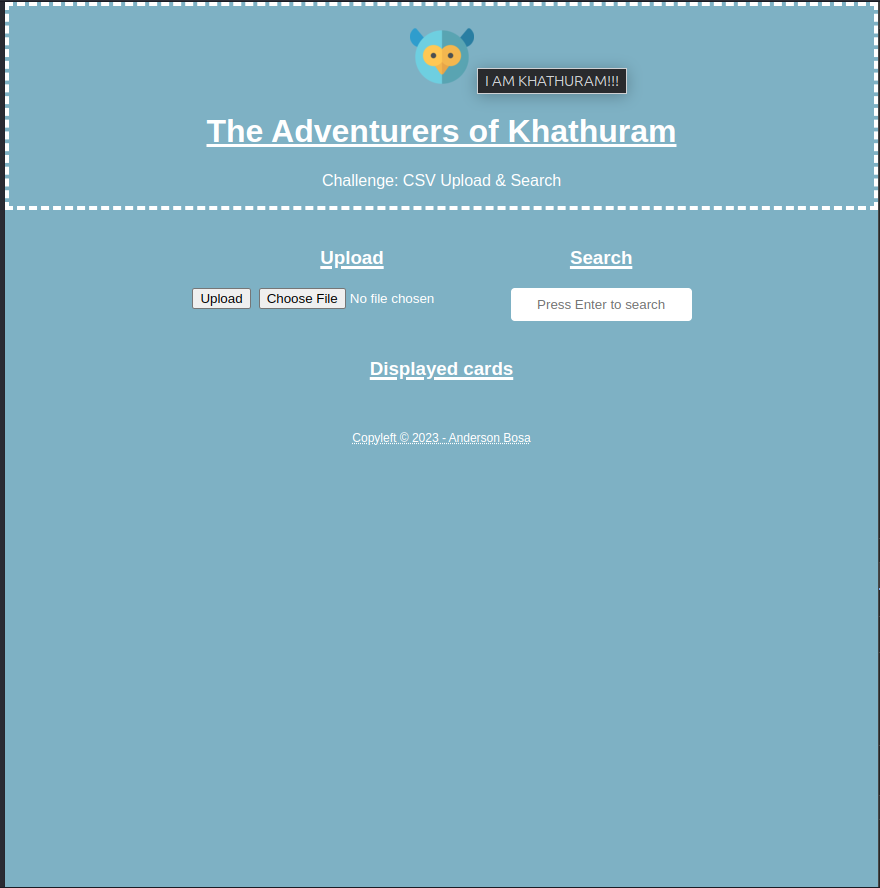
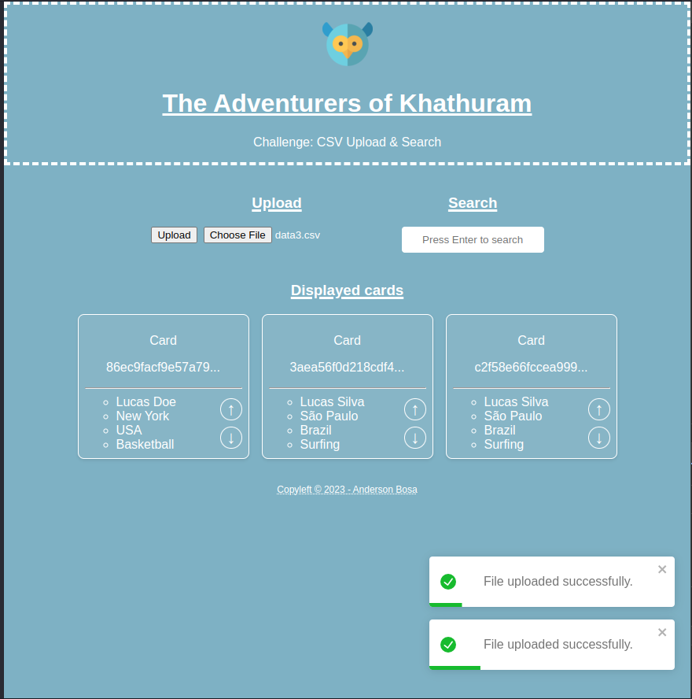
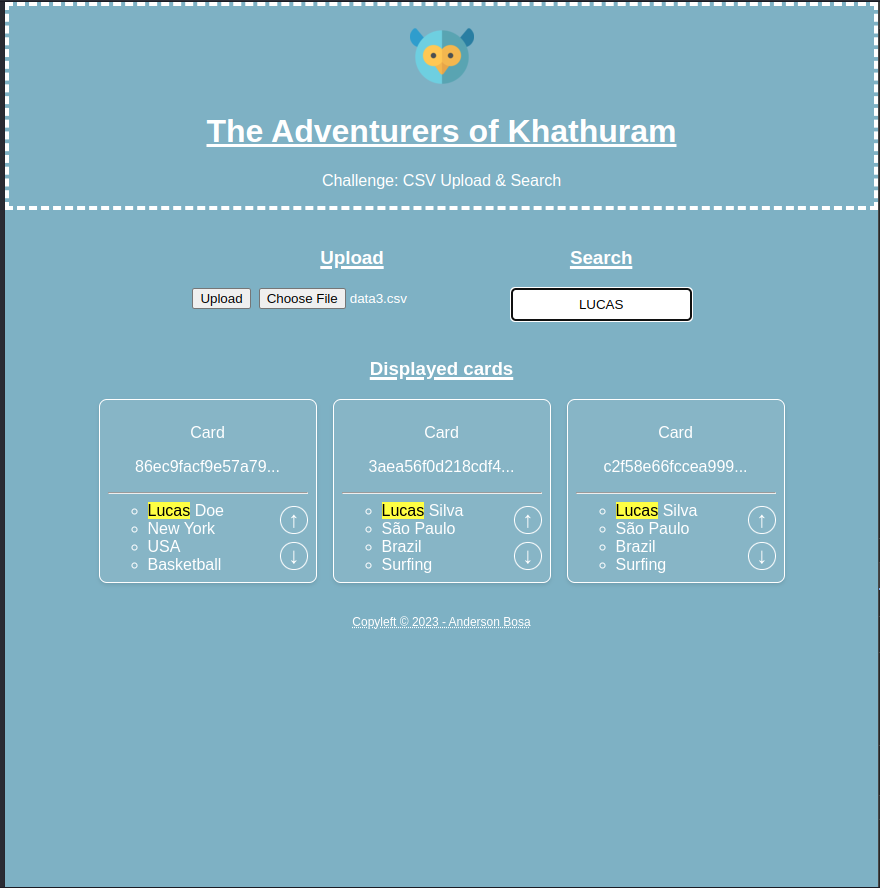
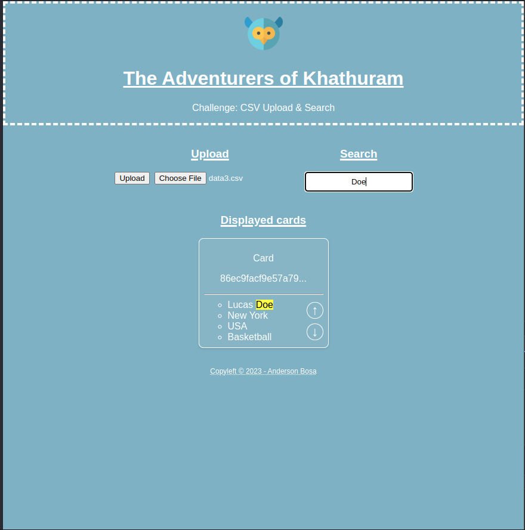
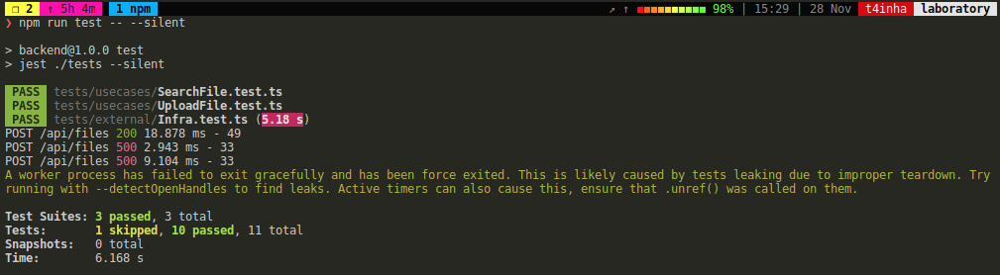

# csv-search-upload

* Repository for educational purposes without active maintenance.
* Fantasy name generated with [donjon](https://donjon.bin.sh/fantasy/name/#type=set)

## Summary

The aim of this assessment is to assess your abilities in both Backend and Frontend development. You must create a website that permits the loading of a preformatted CSV file by users. This data should then be displayed as cards on the site, which the user can filter.

## Demo

- Frontend
- Backend

## Prints

#### Interface

|                                                                             |                                                                            |
| :-------------------------------------------------------------------------: | :------------------------------------------------------------------------: |
|                        Home                         |            Upload CSV file              |
| Search with partial results  | Search with specific results |

#### Test Coverage

